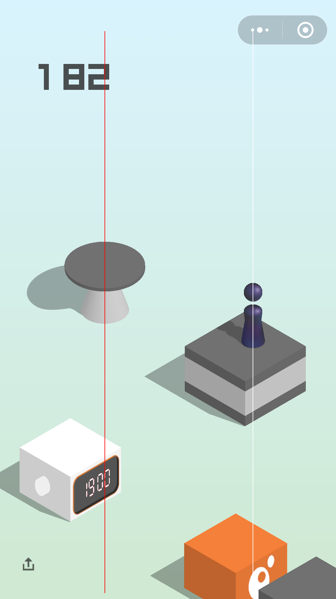

# 让脚本机器人来帮你玩微信跳一跳

* 运行效果
* **依赖环境**
* **运行方法**
* 环境搭建以及运行的具体步骤
* 配置文件说明
* 工具接口
***
## 运行效果

## [小视频](./README_resources/play.mp4)
***
## 依赖环境
* Linux操作系统
* Python解释器
* ADB安卓手机测试工具
* 安卓手机(本项目测试用的手机是MI5)

注：具体搭建方法可以参考本文档的第3部分
***
## 运行方法
* 打开命令行终端后跳转到该项目脚本所在的路径
* 开启手机调试模式并接入PC机
* 把 game_config.json 配置文件中的 serial_num 改成当前手机的 serial number
* 从手机进入微信跳一跳的游戏界面
* 命令行输入`python3 auto_jump_jump.py`并enter，开始运行
* 在Python运行窗口按ctrl+c或者直接关闭窗口即可停止运行

注：具体步骤可以查看下一部分
***
## 环境搭建以及运行的具体步骤
>#### 1.安装Linux
* 建议先下载虚拟机软件VMware，然后在虚拟机上安装ubuntu(*Linux的一种*)，使用时相当于另一台独立的机器。除了运行时占用少数资源，不会对自己现在的电脑环境产生任何影响
* 安装ubuntu时要记住自己设置的用户密码

* [VMware Workstations下载地址](https://my.vmware.com/web/vmware/details?downloadGroup=WKST-1411-WIN&productId=686&rPId=20814)
* [ubuntu下载地址](https://www.ubuntu.com/download/desktop)

>#### 2.安装Python3解释器
* Linux普遍自带Python3解释器。要确认的话可以先用快捷键ctrl+alt+t打开终端,然后在终端输入命令`which python3`，结果显示`/usr/bin/python3`则说明Python3确实已经存在

* 万一真的没有Python3，就在终端输入命令`sudo apt install python3`，然后根据提示输入用户密码(*输入时用户密码是透明的*)，之后等待片刻Python3就装好了(*如果安装过程出现询问一律输入`Y`*)

>#### 3.安装和配置ADB (*Android Debug Bridge*)
* 在终端输入 `sudo apt-get install android-tools-adb`，然后根据提示输入用户密码之后等待安装ADB成功即可(*如果安装过程出现询问一律输入`Y`*)  
* 下面进行ADB配置。先连接手机，然后在终端输入 `lsusb`查看手机的厂商编号和产品编号，例如`18d1:4e12`,记住这两个编号  
* 在终端输入 `echo 0x18d1 >> ~/.android/adb_usb.ini`（*注意这里面的"18d1"要改成自己在上一步记住的第一个编号*）  
* 在终端输入 `echo 'SUBSYSTEM=="usb",ATTRS{idVendor}=="18d1", ATTRS{idProduct}=="4e12",MODE="0666"' >> /etc/udev/rules.d/70-android.rules`*注意这里面的"18d1"和"4e12"要改成自己之前记住的两个编号*）  
* 在终端输入 `chmod a+rx /etc/udev/rules.d/70-android.rules`，至此安装和配置ADB已经完成  
* 重启udev：终端输入 `service udev restart`  
* 找到手机的开发者选项，打开USB调试模式并连接到电脑(*如果找不到的话，在<手机参数>找到操作系统版本一栏，然后连续点击该栏，<开发者选项>就会像隐藏彩蛋一样出现*)  
* 测试：终端输入 `adb devices` 如果显示出类似这样的信息 `wc19f7d3 device`说明一切正常

* 记住自己的这个序列号`wc19f7d3`

>#### 4.运行脚本机器人
* 找到并打开本项目中的game_config.json配置文件，把其中的第一行的序列号改成自己刚才记住的类似`wc19f7d3`的序列号然后保存并关闭文件  
* 从手机进入跳一跳的游戏正式开始界面  
* 找到本项目文件夹，在文件夹的空白处点击右键打开终端，然后执行命令`python3 auto_jump_jump.py`，会弹出Python运行窗口。这时脚本机器人就会开始帮你玩游戏  
* 脚本机器人默认会跳200步，中途要停止的话，关闭Python运行窗口即可  
* 停止之后要继续玩，则再次执行命令`python3 auto_jump_jump.py`

***
## 项目配置文件说明
* 本项目有两个配置文件，其中game_config.json配置的参数控制着机器人玩游戏的过程，calculator_config.json中的参数在计算图像中距离时会用到  
* 用户主要关心的是game_config.json中的头两个参数字段：`"serial_num":"wc19f7d3"`,以及`"sleep_time":2`,前者对应不同手机的序列号，后者是每次跳完之后的等待秒数，太短的话会可能在棋子落地之前就截图分析距离，从而导致计算出错。建议2秒或3秒
***
## 工具接口
* 本项目中还设计了几个可以单独使用的公用接口，只要在game_config.json中修改好自己手机的序列号就可以用这些小工具对自己的手机做一些事情  
* Game类的input_swipe接口可以在手机指定坐标按压指定时间、screenshot可以截取当前手机屏幕  
* Calculator类的cal_dist接口用来分析传入的游戏图像并计算出棋子与目标之间的距离。如果传入一个make_img=True的实参的话，还会在当前目录生成一张标记了棋子与目标位置的新图像，默认名字为cal_dist.png，比如像下面这张：  

